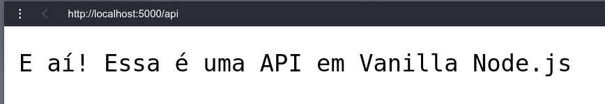

# Uma RestAPI Node.js Vanilla sem frameworks

Node.js é um "framework" bastante popular do JavaScript. Ele acende muito quando usamos para construir serviços e APIs back-end. Desenvolvedores Node.js frequentemente utilizam [frameworks e bibliotecas](https://www.section.io/engineering-education/most-useful-nodejs-packages/) de código aberto como [Express.js](https://www.section.io/engineering-education/express/) para desenvolver suas aplicações. Essas bibliotecas estão prontamente disponíveis nos registros do NPM.

Em qualquer momento que você for utilizar tais pacotes, existem muitas abstrações; por isso você não utiliza as funcionalidades nativas do Node.js. A lógica de baixo nível do Node.js da sua aplicação fica escondida de você com os processos desses pacotes e executa um Node.js puro por baixo dos panos.

Uma coisa importante para observar é que esses pacotes fazem o [Node.js uma tecnologia popular](https://www.section.io/engineering-education/why-node-js-is-popular/). Por outro lado, você pode optar em usar o Node.js puro para desenvolver suas aplicações. Dessa forma, você faz uso das funcionalidades do [Vanilla Node.js](https://www.section.io/engineering-education/pure-node-js-no-frameworks-or-packages/). Esse artigo vai ensinar a você como usar o vanilla Node.js sem frameworks para construir APIs simples.

## Objetivos

Nesse guia, você vai construir uma REST API simples usando funcionalidades nativas do Node.js. Nós vamos
apenas usar a camada que compõe o [vanilla Node.js](https://nodejs.dev/learn) com o [módulo HTTP](https://nodejs.org/api/http.html#http_http) para criar e gerenciar um server.

Isso significa que não vamos usar o NPM. Portanto o NPM não vai precisar gerenciar dependências, sem `package.json`, sem `package-lock.json` e sem a pasta `node_modules`.

O objetivo é mostrar para você como o Node.js funciona em sua forma mais pura e como você pode usá-lo sem bibliotecas
ou frameworks.

> Nota: Quando trabalhando em um projeto real, é uma boa prática usar bibliotecas e pacotes Node.js. Dessa forma, você vai receber muitas vantagens com códigos prontamente disponiveis que fazem seu workflow de desenvolvimento mais fácil e rápido.

## Pre-requisitos

- Garantir que você tem o [Node.js](https://nodejs.org/en/) e [Postman](https://www.postman.com)/[Insomnia](https://insomnia.rest/download) instalado na sua máquina.
- Está familiarizado em como usar o Postman ou Insomnia.
- Conhecimentos básicos sobre o Node.js.
- Entendimento básico de [REST APIs](https://www.section.io/engineering-education/rest-api/) e [Operações de CRUD](https://www.section.io/engineering-education/mysql-with-node-js/).
- Entendimento básico de [JavaScript](https://eloquentjavascript.net). Esse guia usa recursos e sintaxes do [ES6](https://www.javascripttutorial.net/es6/) ([guia original](https://262.ecma-international.org/6.0/)), tal como as [arrow functions](https://www.section.io/engineering-education/how-to-use-javascript-arrow-functions-and-this-keyword/) (=>).

## Configurando um servidor HTTP simples

Antes de criar uma REST API, vamos criar uma simples [API HTTP](https://nodejs.org/en/docs/guides/getting-started-guide/) para servir uma resposta como **E aí?**.

Criando a pasta do projeto e um arquivo `app.js`.

1. A primeira coisa que vamos fazer é puxar o [módulo HTTP](https://nodejs.org/api/http.html#http_http) do Node.js o método `require()`. Esse módulo é nativo do Node.js. Você não precisa de nenhum pacote extra ou biblioteca para acessá-lo, apenas o Node.js instalado em sua máquina.
```js
const http = require("http");
```
Dessa forma, vamos fazer métodos necessários e funções disponíveis para configurar um server.

2. Uma vez feito isso, vamos definir uma porta para qual nosso server vai rodar, como mostrado abaixo.
```js
const PORT = process.env.PORT || 5000;
```
3. Para criar o server, você precisa chamar o método `createServer` do módulo HTTP. Por exemplo, `http.createServer`. Passe uma resposta e uma requisição que forneça suas informações.

Então use:

- `req.url` para definir a requisição para acessar a rota/URL.
- `req.method`
- `res.writeHead` para definir alguma resposta nos cabeçalhos.
- `res.write()` para enviar um conteúdo para a resposta atual.
- `res.end()` para enviar a resposta.
-
```js
const server = http.createServer(async (req, res) => {
    if (req.url === "/api" && req.method === "GET") {
        res.writeHead(200, { "Content-Type": "application/json" });
        res.write("E aí! Essa é uma API em Vanilla Node.js") ;
        res.end();
    } else {
        res.write(400, { "Content-Type": "application/json" });
        res.end(JSON.stringify({ message: "Rota não encontrada" }));
    }
});
```
4. Chame o método `listen()` e passe uma `PORT `válida. Então adicione uma mensagem ao `console.log()` que vai indicar que o servidor está rodando.
```js
server.listen(PORT, () => {
    console.log(`Servidor iniciado na URL -> http://localhost:${PORT}`)
})
```
5. O server está pronto. Execute `node app.js` e teste-o. Isso vai informar aquela mensagem no `console.log()` em sua tela de comando.
```
$ node app.js
Servidor iniciado na URL -> http://localhost:5000
```
6. Se você abrir `http://localhost:5000/api` em seu navegador, você vai receber a resposta que foi definida em `res.write()`.



## Configurando a REST API

Vamos agora ver como configurar a REST API usando o Node.js puro. Vamos usar um modelo de todo para demonstrar isso.

Abaixo vamos ver a estrutura do projeto.
```
\---vanilla-restapi-node
|   app.js
|   controller.js
|   data.js
|   utils.js
```

### Adicionando dados para teste
**data.js**: guarda alguns dados temporários para teste. A informação é mantida em um array chamado `todos`. Toda to-do tem um id único, um titulo, uma pequena descrição e um valor Booleano que marca a to-do como completa.
```js
// data.js
/** Todos List */
const todos = [
    {
        id: 1,
        title: "Codar em JavaScript",
        description: "Trabalhando com funções em JavaScript",
        completed: false,
    },
    {
        id: 2,
        title: "Cozinhar uma sopa",
        description: "Preparando um arroz e frango",
        completed: false,
    },
    {
        id: 3,
        title: "Fazer uma caminhada",
        description: "Passar um tempo no parque",
        completed: false,
    },
    {
        id: 4,
        title: "Assistir Netflix",
        description: "Aproveitar uma nova serie promissora",
        completed: false,
    },
];
module.exports = todos;
```
### Configurando os controllers
**controllers.js**: esse gerencia as funcionalidades atuais e a lógica por trás de cada rota usada na aplicação. Ele é criado de uma classe chamada `Controller`, que vai ter os seguintes métodos principais HTTP:

- `getTodos()`: pega a lista com as todas as todos como listado no arquivo temporário `data.js`.
- `getTodo()`: pega e lista um único to-do pelo id único.
- `createTodo()`: cria uma nova to-do temporária.
- `updateTodo()`: atualiza o valor em uma to-do existente.
- `deleteTodo`: remove uma to-do da lista.
```js
// controller.js
const data = require("./data");

class Controller {
    async getTodos() {
        return new Promise((resolve, _) => resolve(data));
    }

    async getTodo(id) {
        return new Promise((resolve, reject) => {
            let todo = data.find((todo) => todo.id === parseInt(id));
            if (todo) {
                resolve(todo);
            } else {
                reject(`Todo com o id ${id} não encontrado`);
            }
        });
    }

    async createTodo(todo) {
        return new Promise((resolve, _) => {
            let newTodo = {
                id: Math.floor(4 + Math.random() * 10),
                ...todo,
            };

            resolve(newTodo);
        });
    }

    async updateTodo(id) {
        return new Promise((resolve, reject) => {
            let todo = data.find((todo) => todo.id === parseInt(id));
            if (!todo) {
                reject(`Nenhum todo com o id ${id} encontrado`);
            }
            todo["completed"] = true;
            resolve(todo);
        });
    }

    async deleteTodo(id) {
        return new Promise((resolve, reject) => {
            let todo = data.find((todo) => todo.id === parseInt(id));
            if (!todo) {
                reject(`Nenhum todo com o id ${id} encontrado`);
            }
            resolve(`Todo deleted successfully`);
        });
    }
}
module.exports = Controller;
```
### Configurando os utilitários
**utils.js**: controla um caso de uso padrão de API Web. Inclui a função `getReqData()`, que recupera dados do cliente no servidor.
```js
// utils.js
function getReqData(req) {
    return new Promise((resolve, reject) => {
        try {
            let body = "";
            req.on("data", (chunk) => {
                body += chunk.toString();
            });
            req.on("end", () => {
                resolve(body);
            });
        } catch (error) {
            reject(error);
        }
    });
}
module.exports = { getReqData };
```
### Configurando o server e rotas
**app.js**: Aqui contém isso:

- Inicialização e configuração do server.
- As rota apropriadas escutando os vários métodos HTTP de um server.
- Um número de `PORT` para escutar e definir o servidor ao vivo em um navegador.
```js
// app.js
const http = require("http");
const Todo = require("./controller");
const { getReqData } = require("./utils");

const PORT = process.env.PORT || 5000;

const server = http.createServer(async (req, res) => {
    // /api/todos : GET
    if (req.url === "/api/todos" && req.method === "GET") {
        const todos = await new Todo().getTodos();
        res.writeHead(200, { "Content-Type": "application/json" });
        res.end(JSON.stringify(todos));
    }

    // /api/todos/:id : GET
    else if (req.url.match(/\/api\/todos\/([0-9]+)/) && req.method === "GET") {
        try {
            const id = req.url.split("/")[3];
            const todo = await new Todo().getTodo(id);
            res.writeHead(200, { "Content-Type": "application/json" });
            res.end(JSON.stringify(todo));
        } catch (error) {
            res.writeHead(404, { "Content-Type": "application/json" });
            res.end(JSON.stringify({ message: error }));
        }
    }

    // /api/todos/:id : DELETE
    else if (req.url.match(/\/api\/todos\/([0-9]+)/) && req.method === "DELETE") {
        try {
            const id = req.url.split("/")[3];
            let message = await new Todo().deleteTodo(id);
            res.writeHead(200, { "Content-Type": "application/json" });
            res.end(JSON.stringify({ message }));
        } catch (error) {
            res.writeHead(404, { "Content-Type": "application/json" });
            res.end(JSON.stringify({ message: error }));
        }
    }

    // /api/todos/:id : UPDATE
    else if (req.url.match(/\/api\/todos\/([0-9]+)/) && req.method === "PATCH") {
        try {
            const id = req.url.split("/")[3];
            let updated_todo = await new Todo().updateTodo(id);
            res.writeHead(200, { "Content-Type": "application/json" });
            res.end(JSON.stringify(updated_todo));
        } catch (error) {
            res.writeHead(404, { "Content-Type": "application/json" });
            res.end(JSON.stringify({ message: error }));
        }
    }

    // /api/todos/ : POST
    else if (req.url === "/api/todos" && req.method === "POST") {
        let todo_data = await getReqData(req);
        let todo = await new Todo().createTodo(JSON.parse(todo_data));
        res.writeHead(200, { "Content-Type": "application/json" });
        res.end(JSON.stringify(todo));
    }

    // Nenhuma rota presente
    else {
        res.writeHead(404, { "Content-Type": "application/json" });
        res.end(JSON.stringify({ message: "Rota não encontrada" }));
    }
});

server.listen(PORT, () => {
    console.log(`Servidor iniciado na URL -> http://localhost:${PORT}`);
});
```
## Testando a aplicação

Uma REST API em Vanilla Node.js está agora configurada e pronta para teste e ver se tudo está funcionando. Agora você precisa iniciar o server rodando o seguinte comando:
```
node app.js
```
Isso vai definir e inicia o server na porta 5000.
```
$ node app.js
Servidor iniciado na URL -> http://localhost:${PORT}
```

A partir daqui você pode usar o **Insomnia** ou o **Postman** para testar a aplicação. Mas para deixar ela bem mais clara quem não tem muita familiaridade com esses clients. Acesse a pasta `/public` e lá, em um terminal, use o seguinte comando:
```
npx serve
```
Assim, você pode acessar a URL que vai aparecer no prompt para você ver as rotas e suas funcionalidades com mais detalhes.

## Aviso

Esse guia foi feito e inspirado no material disponível pela desenvolvedora [Rose Waitherero](https://www.section.io/engineering-education/authors/rose-waitherero/). O artigo original está [aqui](https://www.section.io/engineering-education/a-raw-nodejs-rest-api-without-frameworks-such-as-express/).

## Licença

[MIT License](./LICENSE)
